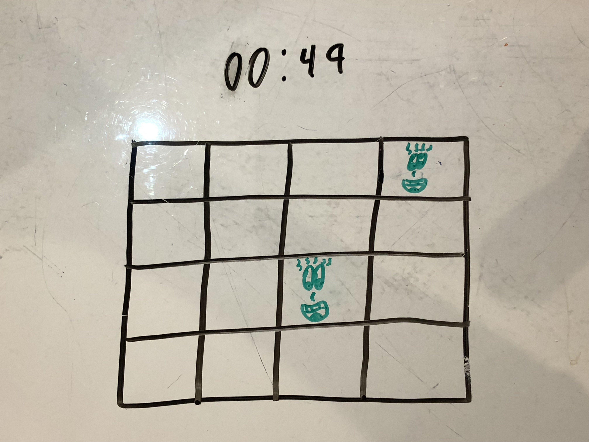
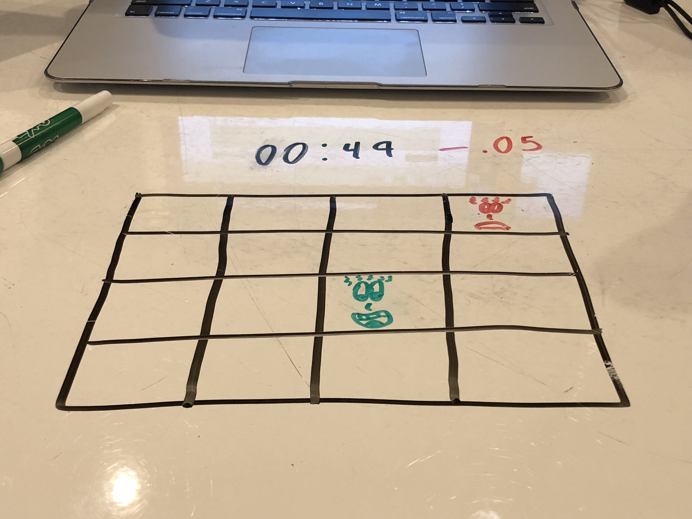
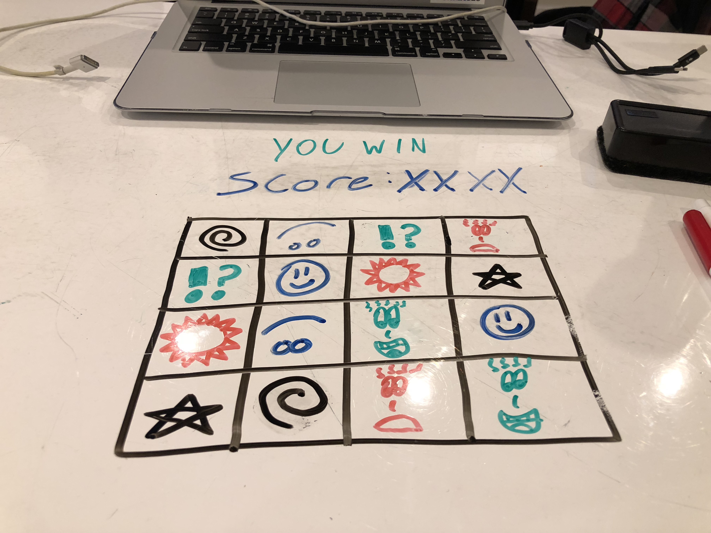
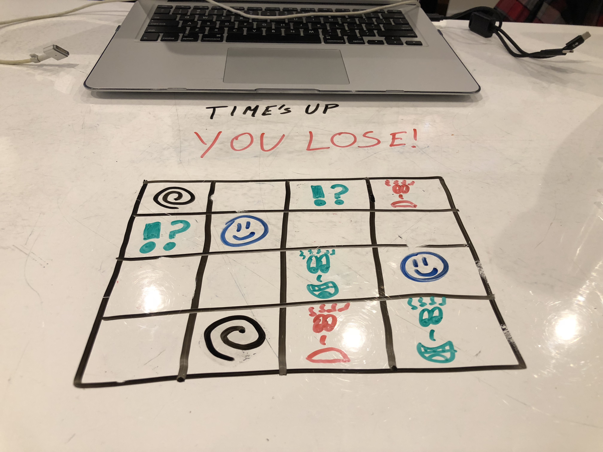

# Memory Match

## Rules
* Race against the clock to find every pair of matching images in order to win the game!
* Guessing incorrectly will shave seconds off your time
* Guessing correctly will add bonus seconds to your time
* Keep playing until you reach the end

## Play Game Here
http://big-circle.surge.sh/

## Specs
* Board is made up of an even amount of cells (ie: 5x5, 6x6 etc.)
* There are pairs of hidden images in random cells
* Each game is timed
* The player clicks in a cell and reveals the image
* The player has to click on a second cell to reveal the next image
* If the first and second images match, they stay visible and the player continues to find the next pair
* If the first and second images do not match, they become hidden, the player loses a few seconds, and then can continue to find the next pair
* Once all of the images are found, the player wins
* If the player runs out of time, they lose
* Game resets and images are randomized

## MVP
* Board is made up of an even amount of cells
* There are pairs of hidden images in cells
* The player clicks in a cell and reveals the image
* The player has to click on a second cell to reveal the next image
* If the first and second images match, they stay visible and the player continues to find the next pair
* If the first and second images do not match, they become hidden, and the player continues to find the next pair
* Once all of the images are found, the player wins the game

## Accomplishment
My biggest struggle that became one of my biggest accomplishments was taking my image array, doubling the images, and randomizing them. What made it difficult was when I first tried to randomize I would get more than two of the same image, I finally solved the problem by using two seperate functions and putting them together. See below:

```javascript
// Doubles the images in the array
function doubleImageArr(level) {
  for (let i = 0; i < level.images; i++) {
    levelImages.push(images[i]);
  }
  for (let i = 0; i < level.images * 2; i++) {
    if (i < level.images) {
      levelImages.push(images[i]);
    }
  }
}

// Randomizes images from levelImages into new array
function randomizeImages(level) {
  while (levelImages.length > 0) {
    let randNum = Math.floor(Math.random() * levelImages.length);
    let removed = levelImages.splice(randNum, 1);
    randomImages.push(removed);
  }
}
```

## Wireframes
   
